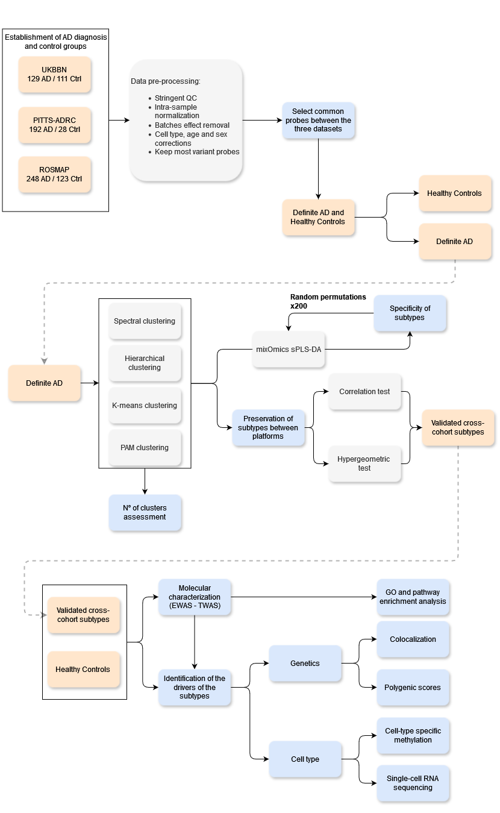

# LOAD_Subtyping

## Background
Accumulating evidence shows that the heterogeneity and temporal complexity of Alzheimer’s Disease (AD) contribute to treatment failure. Advances in omics technologies along with development of efficient integrative analytical pipelines, provide a unique opportunity to investigate the drivers of heterogeneity at multiple molecular levels. In this study, we aim at using DNA methylation data quantified in postmortem prefrontal cortex to identify molecular subtypes of AD, and the distinct molecular features driving the disease heterogeneity.

## Methods
We used DNA methylation data generated in postmortem prefrontal cortex from three independent biobanks: Brain for Dementia Research (BDR; n = 415), the UK BrainBank Network (UKBN; n = 250) and (ROSMAP; n = 710). Multiple unsupervised clustering methods including network-based, Bayesian and Ensemble approaches were applied on DNA methylation data quantified by the Illumina EPIC arrays in the discovery cohort (BDR). Following each clustering method, distinct features related to the identified subtypes were captured using classification models such as sparse partial least square discriminant analysis and random forest. The most accurate models comprising the distinct features were used to label the samples within the two other independent cohorts (UKBN, ROSMAP). 

## Workflow

